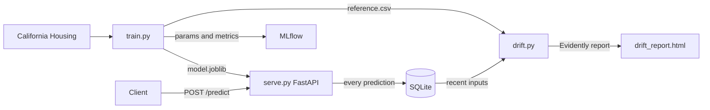

# MLOps Price Prediction


Predicts California house prices using XGBoost, with MLflow experiment tracking, Evidently drift detection, and GitHub Actions CI/CD.

## How it works

The model is trained on the California Housing dataset. Given a set of block-group features (income level, house age, room count, location), it predicts the median house value in units of 100k USD.

## Architecture



## Tech Stack

| Layer | Technology |
|---|---|
| Language | Python 3.11 |
| Model | XGBoost Regressor |
| Dataset | California Housing (scikit-learn) |
| Experiment Tracking | MLflow |
| Drift Detection | Evidently AI |
| API | FastAPI + Uvicorn |
| Containerization | Docker + Docker Compose |
| CI/CD | GitHub Actions |
| Testing | Pytest |

## Quick Start

**Install dependencies**

```bash
pip install -r requirements.txt
```

**Train the model**

```bash
python src/train.py
mlflow ui
```

Open http://localhost:5000 to compare runs across different hyperparameter configs.

**Serve the API**

```bash
uvicorn src.serve:app --reload
```

**Check for data drift**

```bash
python src/drift.py
```

**Run with Docker Compose**

```bash
docker-compose up --build
```

| Service | URL |
|---|---|
| API | http://localhost:8000 |
| Swagger docs | http://localhost:8000/docs |
| MLflow UI | http://localhost:5000 |

## API Endpoints

| Method | Endpoint | Description |
|---|---|---|
| GET | `/health` | Readiness probe |
| POST | `/predict` | Predict house price |
| GET | `/logs` | Recent predictions |
| GET | `/stats` | Price distribution stats |

**Example request:**

```bash
curl -X POST http://localhost:8000/predict \
  -H "Content-Type: application/json" \
  -d '{
    "MedInc": 8.3,
    "HouseAge": 15.0,
    "AveRooms": 7.0,
    "AveBedrms": 1.0,
    "Population": 900.0,
    "AveOccup": 2.8,
    "Latitude": 37.8,
    "Longitude": -122.4
  }'
```

```json
{"predicted_price": 4.2371, "unit": "100k USD"}
```

## Running Tests

```bash
pytest tests/ -v
```

## CI/CD

Every push to `main` trains the model from scratch, runs the test suite, then builds and smoke-tests the Docker image.
